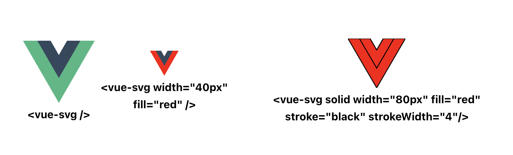

# **Convert Svg Files to the Vue Components**

```bash
#Input                 #Output

svgs                   src/components/svgs
|home.svg              |HomeSvg.vue
|logo.svg              |LogoSvg.vue
|social                |social
    |-instagram.svg         |-InstagramSvg.vue
    |-twitter.svg           |-TwitterSvg.vue
    |dark                   |dark
       |-instagram.svg        |-InstagramSvg.vue
```

## Usage

```bash
npm -D install get-vue-svg
```

You can create a command in your package.json

```bash
"scripts": {
  "svg": "get-vue-svg <your-svg-folder-path>"
},

# npm run svg
```

or launch the following command if you installed it globally.

```bash
get-vue-svg <your-svg-folder-path>
```

Then you can use the component after you imported it.

```js
<VueSvg solid width="40px" fill="blue" stroke="white" strokeWidth="1" opacity="0.4" />
```

## Solid Prop

When you use the solid prop, the fill prop effect the all svg and generate one color(solid) svg.

For Example



## Props

The default values of the following props are their original values, but if the SVG does not have the following properties, the following values will be the default of the SVG props.

\*\* Type of the all props is string except for solid

| props       | default |
| ----------- | ------- |
| width       | 24      |
| height      | 100%    |
| fill        | none    |
| stroke      | none    |
| strokeWidth | 1       |
| opacity     | 1       |
| solid       | false   |

### License

MIT
